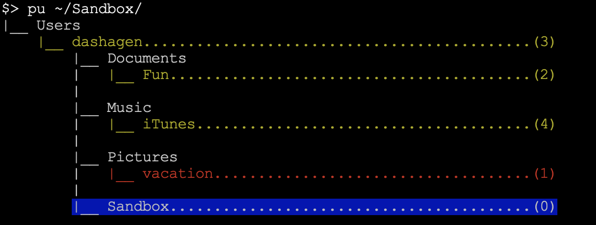

## Introduction
**dirstack-plus** is an enhanced version of the [dirstack](https://www.gnu.org/software/bash/manual/html_node/Directory-Stack-Builtins.html) utiliy in unix/linux systems which maintains a list of recently-visited directories and provides commands(pushd, popd, dirs) to view and switch between these directories. **dirstack-plus** enhances these simple commands to provide a tree view of the dirstack and much more convenient commands to navigate through it. 


## Installation 

1. Create ~/.dirstack folder
2. Copy `dsfunc.sh` to ~/.dirstack
3. Copy  `dt` and `getprjnum` to where you put your executable scripts (/usr/local/bin, /usr/bin/, /$HOME/bin/ etc.). Just make sure the path is added to $PATH
4. Add the following line to your ~/.bashrc file
   ```bash
   source $HOME/.dirstack/dsfunc.sh
   ```
5. Restart your terminal.


## Usage

### Launching the terminal
Whenever your terminal is launched, previous directory stack associated with the current tty number will be loaded. 


And you will be at directory 0 (in this case "/Users/dashagen/Documents/Fun"). You can then navigate through the directories as usual. Following are the commands:

### List directory tree
type `dt` to list the directory tree. Directory 0, the current directory, will be in blue background and directory 1, the one last visited, will be highligted in red. <br>

Now you can either navigate to a directory by its number ([`r NUM`](#rotate-to-a-directory)) or enter into a new directory. In the latter case you can either replace the current directory ( `cd new_directory` )  or save the current directory and push a new one to the directory stack and `cd` to it ( [`pu`](#push-in-a-new-directory) ).

### Directory Variables
For convenince of quick reference of directories registered in the directory stack, a set of 'environment' variables are created for each of the directories. They take the form of `$dir#` where `#` corresponds to the directory number of that directory. These variables are extremely useful. You can, for example, list the content of directory 3 by typing `ls $dir3`. You can also copy/move files between directories, for example `cp $dir4/*.txt .` or `cp $dir5/* $dir3/`.

### Rotate to a directory
After you type `dt` and view the directory tree, find the corresponding directory number (`NUM`) for the directory you want to rotate to, then type `r NUM`. Say if we want to switch to directory `3`
<br>

What you will see is the content of the target directory (directory 3, "vacation"). Meanwhile the directory stack has been refreshed and you will be currently at "vacation" which becomes directory 0.

Note that the previously visited directory "Fun" becomes directory 1. You can simply type `r` to switch back to "Fun". Then "vacation" will become directory 1 again. So in other words, typing `r` can help you toggle between two directories back and forth without resorting to directory numbers.


### Push in a new directory

Suppose you are at directory "vacation" as shown in last section and you would like to enter ~/Sandbox without losing track of "vacation". You can simply type `pu ~/Sandbox` to switch to ~/Sandbox.
<br>


### Remove a directory 

Simply type `po` will remove the current directory (directory 0) or `po NUM` which will remove directory `NUM`. Continue with above example, say if we want to remove directory 2 ('Fun').
<br>

### Load a saved directory stack 

If you have saved the directory stack from `~/.dirstack/dirstack#` to a separate file, you can later reload it by typing `lstack <dirstack file>`


## License

[MIT licensed](https://github.com/dashagen/dirstack-plus/blob/master/LICENSE).
